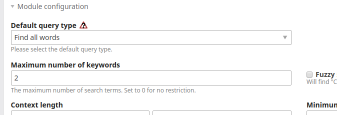

# Contao Search Bundle

[](https://packagist.org/packages/heimrichhannot/contao-search-bundle)
[](https://packagist.org/packages/heimrichhannot/contao-search-bundle)

This bundle contains enhancements for Contao Search. You can enable or disable all functionality to pick up just the features you need.

## Features
* Rebuild search index command for contao versions before 4.9
* Disable search index update on page visit
* set maximum number of search terms
* Page filter for search module
* Related search content element
* log search terms

## Usage

### Install

1. Install composer bundle: `composer require heimrichhannot/contao-search-bundle`
1. Optional: Install guzze HTTP client: `composer require guzzlehttp/guzzle` (needed for rebuild search index command)
1. Enable/Disable features you want in your project config (see chapter configuration) and clear your cache
1. Update your database

### Maximum number of search terms

1. Be sure `huh_search.disable_max_keyword_filter` is set to false (is false by default)
1. Set maximum number of keywords to a value higher than 0 to enable

    
    
1. If you want to output a user notice if the max keyword count is exceeded, select `mod_search_searchbundle` module template or output `$this->maxKeywordsExceededMessage` template variable where you like.
1. If you need to support a language with special letters like german umlauts, you can pass additional chars to the `huh_search.valid_word_chars` option to get a correct word count. By default, the german umlauts and eszett are preconfigured. Keep in mind, that you override the default value by setting this option (so you need to add them in your config if you want to support them).

Example: 
```php
// mod_search.html5

<?php if ($this->maxKeywordsExceededMessage): ?>
    <p class="header"><?= $this->maxKeywordsExceededMessage ?></p>
<?php endif; ?>

<?php if ($this->header): ?>
    <p class="header"><?= $this->header ?> (<?= $this->duration ?>)</p>
<?php endif; ?>
```

1. If you want to customize the message, overwrite the translations keys for `huh_search.module.max_keywords_exceeded_message` (Symfony translations used). `%count%` (number of provided keywords) and `%max%` (max allowed number of keywords) are provided as placeholder values.

### Filter your search results by page

1. Enable `huh_search.enable_search_filter` in your config (enabled by default)
1. Create or edit your search engine module and setup the search filter section as you like

    

### Related search content element

This element is basically the content hyperlink element (also uses the same templates) but with the twist, that it keeps the search parameters. It's designed for use together with news filter to link to another search module with a different filter config.

1. Create a Related search link content element on a page with an search module
1. Set another page with a search module as target

### Disable search indexer

> If you use contao 4.9 or higher, we recommend to use the [core implementation](https://docs.contao.org/dev/framework/search-indexing/) instead.

This option let you disable indexing page on every page visit. This is recommend for large websites if you find performance issues or have a lot of duplicates in your search index.

1. Enable `huh_search.disable_search_indexer`
1. We recommend to use this option combined with the `huh:search:index` command

### Search keyword log

To log search keywords, just set `huh_search.enable_search_log` to true. Afterwards you'll find `huh_search_log`-files withing your log folder containing a csv-formatted list of datetime and keyword. Maximum 7 days are stored (you can alter this period by customizing the monolog settings for huh_search_log channel).

## Search index command

> If you use contao 4.9 or higher, we recommend to use the [core implementation](https://docs.contao.org/dev/framework/search-indexing/) instead.

This command let you build up your search index from console or a periodic cron job. This is especially useful, if you can't rebuild your search index from the contao backend. Pages that could not be indexed are logged into an huh_search log file in your log folder.

```
Usage:
  huh:search:index [options]

Options:
      --dry-run                    Performs a run without purging the search database.
      --concurrency[=CONCURRENCY]  Number of parallel requests [default: 5]
```


## Configuration

```yaml
huh_search:

    # Enable or disable search filter for search module
    enable_search_filter: true

    # Enable or disable max keyword filter for search module
    disable_max_keyword_filter: false

    # Configure whether you want to update the index entry on every request
    disable_search_indexer: false

    # Enable a search keyword logging.
    enable_search_log:    false

    # Set additional chars that should be not break a word (used for charlist parameter of str_word_count function).
    valid_word_chars:     ÄäÖöÜüẞß
```

## Extend

### Events

Event | Description
----- | -----------
BeforeGetSearchablePagesEvent | Is triggered before a getSearchablePages hook entry is called in RebuildSearchIndexCommand. You'll be able to modifiy class, method, pages-Array or skip execution of current hook entry.